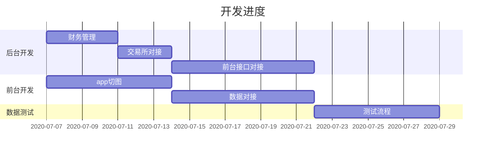

# 开发进度

- [x] 权限管理
- [x] 管理员管理
- [x] 错误日志
- [x] 系统设置
- [x] 会员管理
- [x] 系统分类 
  - [x] 基础分类
  - [ ] 多级分类 <~ todo
  - [ ] 

```mermaid
gantt
    title 开发进度
    dateFormat  YYYY-MM-DD
    section 后台开发
    财务管理           :a1, 2020-07-07, 4d
    交易所对接     :a11, after a1  , 3d
	前台接口对接     :after a11  , 8d
    section 前台开发
    app切图      :a2, 2020-07-07  , 7d
    数据对接     :after a2  ,  8d
	section 数据测试
	测试流程      :a3, 2020-07-22  , 7d
```
